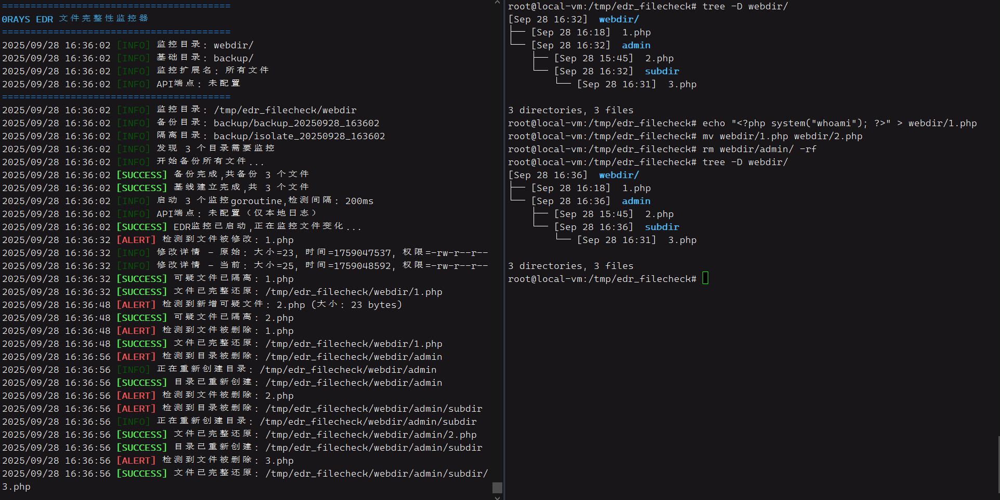

# 0RAYS-AWD-Filechecker

一个用Golang编写的, 轻量级的文件监控器, 会监控指定文件夹内文件删除, 修改, 新增操作, 然后立刻告警并复原. 效果如图所示

一开始是为AWD比赛写的, 主要是为了防止靶机的web目录被上马. 但也可以用到蓝队等场景上.

由于使用的Linux的lstat系统调用, 故**仅支持Linux环境使用, 不支持windows**.



### 工作流程

1. 程序启动后扫描指定监控目录，将所有符合条件的文件完整备份到workspace下的backup目录中
2. 对所有监控文件建立基线信息，记录文件大小、修改时间、权限、UID/GID等元数据
3. 发现所有子目录后，为每个目录启动一个独立的goroutine进行监控
4. 每个goroutine每200ms扫描其负责目录的直接子文件，通过lstat获取文件元数据与基线对比
5. 监测文件的元数据是否有变化, 以及文件和路径是否有被删除等
6. 告警机制：所有异常变化都会记录日志，如果配置了API端点则同时发送HTTP告警

### 功能特性

- 支持指定拓展名, 例如指定php文件, 这样避免监控一些静态的html,css文件, 减少占用
- 高频检测, 期望响应时间100ms, 基本上php马刚传上来就立刻被删除
- notifier.py支持跨平台, 有python环境即可, 会通过弹窗告警, 告知选手或队员立即处理问题(可选)

```plaintext
┌─────────────────┐    HTTP API   ┌──────────────────┐
│    文件监控器     │ ────────────► │  notifier.py     │
│  (awd-checker)  │               │  (桌面弹窗告警)    │
└─────────────────┘               └──────────────────┘
         │
         ▼
┌─────────────────┐
│  靶机文件系统     │
│  ┌─── 监控 ─┐    │
│  ├─── 备份 ──┤   │  
│  └── 隔离 ──┘    │
└─────────────────┘
```

### 注意事项

1. 本项目只是把文件备份后观察文件的变化, 不能抵御一些完美的在不影响元数据的情况下作出的修改, 不适合防御APT攻击
2. 不能防御内存马. 假如项目中有漏洞, 可以实现无文件落的打内存马, 这是无法防御的
3. 攻击者依然有可能打静态条件, 由于项目是100ms监测一次, 对于http请求来说是很短的间隔, 但若攻击者一直打上传和运行的这个timing, **依然有可能导致成功运行马子**. 所以你要是担心这个问题, 建议调整间隔, 在时间和性能之间取舍. 对于一般的AWD或者蓝队, 100ms是很足够了, IO占用也很低了, 攻击者基本都会以为传不上来或者被杀掉了.

### 使用

release里面直接下载对应的平台的版本即可. 或者go build awd-filechecker.go

#### Filechecker参数

```
-m 监控目录路径(必须)             -m /var/www/html
-b workspace目录路径(必须)       用于存放backup_和isolate_子目录-b /home/ctf/edr_workspace
-e 监控的文件扩展名,逗号分隔       -e .php,.jsp,.html
-a API端点地址，用于发送告警       -a 172.16.66.66:8080
-h 显示帮助信息
```

#### notifier.py参数

```
-p, --port    HTTP服务监听端口8080
-H, --host    监听地址0.0.0.0
--no-sound    禁用告警音效
--test        发送测试通知
```

#### 典型场景

监控php webshell:

```bash
./awd-filechecker -m /var/www/html -b /home/ctf/edr_workspace -e .php -a [选手靶机]:8080
```

监控jsp, 不使用notifier

```bash
./awd-filechecker -m /var/www/html -b /home/ctf/edr_workspace -e .jsp,.asp
```

### notifier api接口

```plaintext
GET /api/agent/edr-alert?type=warning&message=检测到可疑文件shell.php
```

